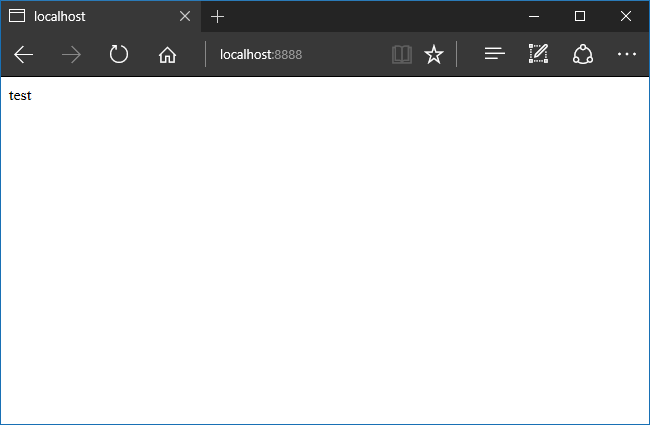

# MathematicaSimpleServerCreate[]

---

**MathematicaSimpleServerCreate[**_port_, _handler_**]**

---

## Детали и опции

- `MathmeticaSimpleServerCreate[...]` возвращает объект `MathmeaticaSimpleServer[...]`
- _port_ - целое числом больше 1024 и меньше 10000
- _handler_ - обработчик соединения с сокетом, представляет собой объект типа `ConnectionHandler[...]`

## Примеры

### Основные примеры

Если приложение установлено, то необходимо загрузить его: 

```mathematica
Get["MathemeticaSimpleServer`"]
```

Затем можно создать сервер с _неопределенным_ обработчиком: 

```mathematica
port = 8888
handler = ConnectionHandler[]
server = MathematicaSimpleServerCreate[port, handler]
```

Обработчик `ConectionHandler[]` должен уметь читать  
из потока ввода и записывать в поток вывода.  
Самый простой обработчик будет выглядеть следующим образом: 

```mathematica
ConnectionHndler[][{in_InputStream, out_OutputStream}] := 
(
  While[True, TimeConstrained[BinaryRead[in], 0.01, Break[]]];
  Close[in]; 
  BinaryWrite[out, "HTTP/1.1 200 OK\r\nContent-Length: 4\r\n\r\ntest"];
  Close[out];
); 
```

Приложение позволяет создать такого рода определение для типа  
`ConnectionHandler[]`, потому что это никаким образом не влияет  
на уже существующее определение в файле `ConnectionHandler.m`  
После выполнения кода выше, можно открыть браузер по адресу  
[http://localhost:8888/](http://localhost:8888/) и окно браузера отобразит слово `test`  


